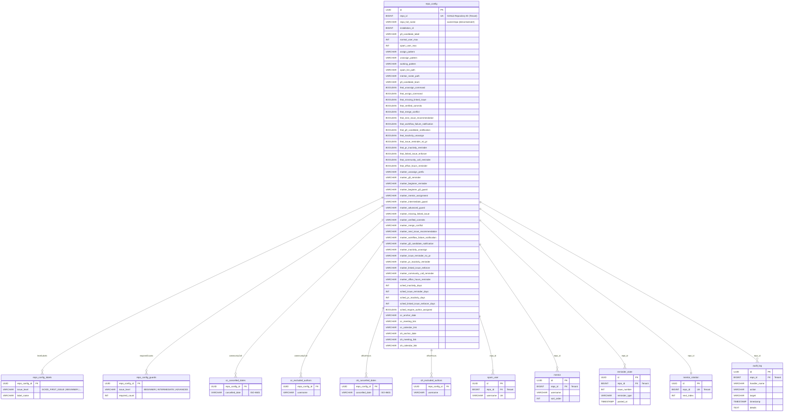

# Octobird Roadmap - Migration der GitHub Actions zur Java App

## Übersicht

Diese Roadmap beschreibt die Migration der bestehenden GitHub Actions Workflows aus dem `actions/`-Ordner
in native EventHandler der Octobird Java-Applikation. Die Features sind in Phasen gruppiert, priorisiert
nach Abhängigkeiten, Nutzen und technischer Machbarkeit.

---

## ✅ Phase 1: Kern-Infrastruktur & Basis-Commands — ABGESCHLOSSEN

> Grundlage für alle weiteren Features. Erweitert die bestehende Handler-Architektur.

- ✅ **1.1 Spam-Liste & Berechtigungssystem** — `SpamListLoader`, `PermissionChecker` in `util/`
- ✅ **1.2 `/unassign`-Command Handler** — `UnassignCommandHandler`
- ✅ **1.3 `/working`-Command Handler** — `WorkingCommandHandler`
- ✅ **1.4 Assignment-Limit-Check** — `AssignmentLimitHandler`

---

## ✅ Phase 2: Issue-Assignment-Pipeline — ABGESCHLOSSEN

> Kernfeature: Contributor weisen sich selbst Issues zu. Aufbauend auf Phase 1.

- ✅ **2.1 GFI `/assign`-Command Handler** — `GfiAssignCommandHandler`
- ✅ **2.2 Beginner `/assign`-Command Handler** — `BeginnerAssignCommandHandler`
- ✅ **2.3 Mentor-Assignment** — `MentorAssignmentHandler`, `MentorRosterLoader`
- ✅ **2.4 CodeRabbit Plan Trigger** — `CodeRabbitPlanTriggerHandler`
- ✅ **2.5 Intermediate Assignment Guard** — `IntermediateAssignmentGuardHandler`
- ✅ **2.6 Advanced Requirement Check** — `AdvancedAssignmentGuardHandler`

---

## ✅ Phase 3: PR-Qualitätschecks (Webhook-basiert) — ABGESCHLOSSEN

> Features die auf PR-Events reagieren und keine lokale Build-Umgebung benötigen.

- ✅ **3.1 Fehlende Issue-Verlinkung** — `MissingLinkedIssueHandler`
- ✅ **3.2 Verified Commits Check** — `VerifiedCommitsHandler`
- ✅ **3.3 Merge-Conflict-Erkennung** — `MergeConflictHandler`
- ✅ **3.4 Next-Issue-Empfehlung** — `NextIssueRecommendationHandler`
- ✅ **3.5 Workflow-Failure-Benachrichtigung** — `WorkflowFailureNotificationHandler`

---

## ✅ Phase 4: Label-basierte Benachrichtigungen — ABGESCHLOSSEN

> Einfache, aber wichtige Automatisierungen für Team-Kommunikation.

- ✅ **4.1 P0-Issue-Alarm** — `P0IssueAlarmHandler`
- ✅ **4.2 GFI-Kandidat-Benachrichtigung** — `GfiCandidateNotificationHandler`

---

## Phase 5: Scheduled Tasks (Cron-basiert) ✅ Abgeschlossen

> Erfordert den `ScheduledTaskManager`. Diese Features pollen den Repo-Status periodisch.

### 5.1 Inaktivitäts-Unassignment
- **Migriert:** `bot-inactivity-unassign.yml`
- **Schedule:** Täglich
- **Phase A:** Issues ohne PR → Unassign nach 21 Tagen (sofern kein `/working`)
- **Phase B:** Issues mit PR → PR schließen + Unassign wenn PR 21 Tage stale
- Prüft Timeline-Events und `/working`-Kommentare

### 5.2 Issue-Erinnerung (kein PR erstellt)
- **Migriert:** `bot-issue-reminder-no-pr.yml`
- **Schedule:** Täglich
- Findet assigned Issues ohne verlinkte offene PRs
- Postet Erinnerung nach 7 Tagen
- Immunität durch `/working`-Kommentar

### 5.3 PR-Inaktivitäts-Erinnerung
- **Migriert:** `bot-pr-inactivity-reminder.yml`
- **Schedule:** Täglich
- Prüft alle offenen PRs auf letzten Commit
- Erinnerung nach 10 Tagen Inaktivität

### 5.4 Linked-Issue-Enforcer
- **Migriert:** `bot-linked-issue-enforcer.yml`
- **Schedule:** 2x wöchentlich (Mo + Do)
- Prüft alle offenen PRs älter als 3 Tage
- Validiert: Issue verlinkt (GraphQL: closingIssuesReferences)
- Optional: PR-Author ist dem Issue zugewiesen
- Schließt PR + Kommentar bei Verstoß

### 5.5 Community-Call-Erinnerung
- **Migriert:** `bot-community-calls.yml`
- **Schedule:** Mittwochs (alle 2 Wochen)
- Postet Erinnerung auf je einem Issue pro externem Contributor
- Konfigurierbare Absagedaten

### 5.6 Office-Hours-Erinnerung
- **Migriert:** `bot-office-hours.yml`
- **Schedule:** Mittwochs (alle 2 Wochen, versetzt)
- Postet Erinnerung auf je einem PR pro externem Contributor
- Konfigurierbare Absagedaten

---

## ✅ Phase 6: Persistenz & Konfigurations-API — ABGESCHLOSSEN

> Ersetzt die dateibasierte Konfiguration (`.github/hiero-bot.yml`) durch eine datenbankgestützte
> Lösung mit REST-API. Grundlage für das spätere Web-Frontend.

### Architektur-Entscheidungen

- **ORM:** JPA (Jakarta Persistence) mit Hibernate als Provider
- **Datenbanken:** PostgreSQL (Produktion), H2 In-Memory (Entwicklung/Tests)
- **Multi-Tenancy:** Repository = Tenant. Jede Entity trägt eine `repo_id`-Spalte
  als Diskriminator. Alle Queries filtern implizit nach Repository.
- **Schema-Migration:** Flyway für versionierte Migrationen
- **Schichtenarchitektur:** Entities sind ein internes Detail der Persistenz-Schicht.
  Darüber liegt eine Service-Schicht, die zwischen Entities und den bestehenden
  Config-Records / DTOs übersetzt. Handler und REST-Endpoints arbeiten **nie** direkt
  mit Entities.

### Schichtenmodell

```
┌─────────────────────────────────────────────────────────┐
│  REST-Endpoints (Helidon)                               │
│  Serialisieren/Deserialisieren Config-Records als JSON  │
├─────────────────────────────────────────────────────────┤
│  Handler / Scheduled Tasks                              │
│  Arbeiten mit Config-Records (RepoConfig, LabelsConfig…)│
├─────────────────────────────────────────────────────────┤
│  Service-Schicht                                        │
│  Mappt Entity ↔ Config-Record                           │
│  Steuert Transaktionen (TransactionManager)             │
├─────────────────────────────────────────────────────────┤
│  Repository-Schicht (AbstractRepository<T>)             │
│  Arbeitet ausschließlich mit JPA-Entities               │
│  Transaktions-agnostisch                                │
├─────────────────────────────────────────────────────────┤
│  JPA / Hibernate / DataSource                           │
│  PostgreSQL (prod) · H2 (dev/test)                      │
└─────────────────────────────────────────────────────────┘
```

Die bestehenden Config-Records (`LabelsConfig`, `GuardsConfig`, `FeaturesConfig`, …) dienen
als **gemeinsames Datenmodell** für Handler und REST-API. Separate DTOs sind nicht nötig — die
Records sind bereits immutable Java Records mit Jackson-kompatibler Struktur.

**Datenfluss-Beispiele:**

- **Handler liest Config:** Handler → `RepoConfig` (Interface) ← Service lädt Entity
  aus Repository, mappt auf `DefaultRepoConfig` (bestehender Record)
- **REST GET Config:** Service lädt Entity → mappt auf Config-Records → Jackson
  serialisiert als JSON
- **REST PUT Config:** Jackson deserialisiert JSON → Config-Records → Service mappt auf
  Entity, persistiert via Repository

### ✅ 6.1 JPA-Infrastruktur & Multi-Tenancy

**Abhängigkeiten hinzufügen:**
- `jakarta.persistence-api`, `hibernate-core`, `flyway-core`
- `postgresql` (Runtime), `h2` (Test)
- Helidon-Integration für JPA/DataSource (oder manuelles `EntityManagerFactory`-Setup)

**Multi-Tenant-Design:**
- Kein Schema-per-Tenant, kein separater DB-Katalog — stattdessen **Discriminator-Column-Ansatz**
- **Tenant-Diskriminator: `repo_id`** (numerische GitHub Repository-ID, immutabel)
  - `repo_full_name` wird als denormalisiertes Anzeigefeld mitgeführt, ist aber **nicht** der
    Primärschlüssel oder FK — bei Repo-Umbenennung ändert sich nur dieses Feld
  - Ein `RepositoryRenamedHandler` reagiert auf das GitHub-Webhook-Event
    `repository` / `renamed` und aktualisiert `repo_full_name` in der DB
- Ein `TenantContext` (ThreadLocal oder virtual-thread-scoped) wird pro Webhook-Request gesetzt
- JPA-Repositories filtern automatisch nach `repo_id`
- Profil-basierte DataSource-Konfiguration in `application.yaml` (`dev` → H2, `prod` → PostgreSQL)

**Flyway-Migrationen:**
- Verzeichnis `src/main/resources/db/migration/`
- Namensschema: `V001__create_repo_config.sql`, `V002__create_app_state.sql`, etc.

### ✅ 6.2 Datenbank-Schema



### ✅ 6.3 Entities

Ersetzt `RepoConfigLoader` + `RepoConfigMapper` (aktuell: YAML via GitHub API → Records).

**Haupt-Entity `RepoConfigEntity`** — eine Zeile pro Repository:

| Spalte | Typ | Beschreibung |
|---|---|---|
| `id` | `UUID` | Primärschlüssel |
| `repo_id` | `BIGINT` | GitHub Repository-ID (immutabel), Unique — Tenant-Diskriminator |
| `repo_full_name` | `VARCHAR` | Anzeigename (`owner/repo`), wird bei Umbenennung aktualisiert |
| `installation_id` | `BIGINT` | GitHub App Installation-ID |

**Eingebettete Konfigurationsblöcke** (JPA `@Embedded` / `@ElementCollection`):

- **Labels** — `Map<IssueLevel, String>` als `@ElementCollection` + `gfi_candidate VARCHAR`
- **AssignmentLimits** — `@Embedded`: `normal_user_max INT`, `spam_user_max INT`
- **Guards** — `Map<IssueLevel, Integer>` als `@ElementCollection`
- **Features** — `@Embedded`: ein `BOOLEAN`-Feld pro Feature-Flag
- **Markers** — `@Embedded`: ein `VARCHAR`-Feld pro Marker
- **Commands** — `@Embedded`: `assign_pattern`, `unassign_pattern`, `working_pattern`
- **Paths** — `@Embedded`: `spam_list`, `mentor_roster`
- **Teams** — `@Embedded`: `gfi_candidate_team`
- **Scheduled** — `@Embedded`: Schwellwerte + verschachtelte `CommunityCall`/`OfficeHours`

**Wichtig:** Entities sind ein internes Detail der Persistenz-Schicht. Kein Handler oder
REST-Endpoint importiert jemals eine Entity-Klasse.

**Listen-Entities** (eigene Tabellen mit FK auf `RepoConfigEntity`):

| Entity | Spalten | Zweck |
|---|---|---|
| `SpamUserEntity` | `repo_id`, `username` | Ersetzt `.github/spam-list.txt` |
| `MentorEntity` | `repo_id`, `username`, `sort_order` | Ersetzt `.github/mentor_roster.json` |

### ✅ 6.4 App-State-Entities

State den die App selbst verwaltet (nicht vom User konfiguriert):

| Entity | Spalten | Zweck |
|---|---|---|
| `ReminderStateEntity` | `repo_id`, `issue_number`, `reminder_type`, `posted_at` | Letzte Erinnerungszeitpunkte pro Issue |
| `MentorRotationEntity` | `repo_id`, `next_index` | Mentor-Rotations-Zähler |
| `AuditLogEntity` | `repo_id`, `handler_name`, `action`, `target`, `timestamp`, `details` | Protokoll aller Bot-Aktionen |

### ✅ 6.5 JPA-Repository-Schicht

**Abstrakte Basisklasse `AbstractRepository<T>`:**

Alle Repositories erben von einer generischen Basisklasse, die wiederkehrende CRUD-Operationen
und Multi-Tenancy-Filterung kapselt:

```java
public abstract class AbstractRepository<T> {
    private final EntityManager em;
    private final Class<T> entityClass;

    protected AbstractRepository(EntityManager em, Class<T> entityClass) { ... }

    // Basis-CRUD (alle gefiltert nach repoId)
    protected T findById(Object id) { ... }
    protected List<T> findAllByRepo(long repoId) { ... }
    protected void persist(T entity) { ... }
    protected void remove(T entity) { ... }

    // EntityManager-Zugriff für abgeleitete Klassen (z.B. für TypedQuery)
    protected EntityManager em() { return em; }
}
```

**Konkrete Repositories:**

```
com.openelements.octobird.persistence/
├── AbstractRepository.java            # Generische Basisklasse (CRUD + Multi-Tenancy)
├── RepoConfigRepository.java          # findByRepoId(), save(), delete()
├── SpamUserRepository.java            # isSpamUser(repoId, username), addUser(), removeUser()
├── MentorRepository.java              # findByRepoId(), save(), reorder()
├── ReminderStateRepository.java       # findLastReminder(repoId, issue, type), save()
├── MentorRotationRepository.java      # getAndIncrement(repoId)
└── AuditLogRepository.java            # log(repoId, handler, action, target), findRecent(repoId)
```

**Transaktionshandling:**

Transaktionen werden **nicht** in der Repository-Schicht verwaltet, sondern eine Ebene darüber —
am Eintrittspunkt der Verarbeitung (Webhook-Request bzw. Scheduled-Task-Ausführung):

- Ein `TransactionManager` kapselt `begin()` / `commit()` / `rollback()`:
  ```java
  public class TransactionManager {
      private final EntityManager em;

      public <R> R executeInTransaction(Function<EntityManager, R> work) {
          EntityTransaction tx = em.getTransaction();
          tx.begin();
          try {
              R result = work.apply(em);
              tx.commit();
              return result;
          } catch (Exception e) {
              tx.rollback();
              throw e;
          }
      }
  }
  ```
- **Webhook-Requests:** Der `EventRouter` (oder ein Wrapper) öffnet eine Transaktion vor
  dem Handler-Aufruf und committed nach erfolgreicher Verarbeitung. So können Handler
  mehrere Repositories nutzen, die alle in einer gemeinsamen Transaktion laufen.
- **Scheduled Tasks:** Analog — der `ScheduledTaskManager` umschließt jede Task-Ausführung
  mit einer Transaktion.
- **REST-API:** Jeder Request-Handler öffnet/schließt seine eigene Transaktion.
- **EntityManager-Lifecycle:** Pro Request/Task wird ein frischer `EntityManager` aus der
  `EntityManagerFactory` erzeugt und nach Abschluss geschlossen. Kein geteilter
  `EntityManager` über Requests hinweg.
- Repositories selbst sind **transaktions-agnostisch** — sie arbeiten auf dem übergebenen
  `EntityManager` und kümmern sich nicht um `begin`/`commit`.

### ✅ 6.6 Service-Schicht (Entity ↔ Record/DTO-Mapping)

Die Service-Schicht ist die einzige Stelle, die sowohl Repositories (Entities) als auch
die bestehenden Config-Records kennt. Sie übersetzt zwischen beiden Welten.

```
com.openelements.octobird.service/
├── RepoConfigService.java        # Entity ↔ RepoConfig (Records)
├── SpamUserService.java          # Entity ↔ List<String>
├── MentorService.java            # Entity ↔ List<String> (geordnet)
├── ReminderStateService.java     # Entity ↔ fachliche Queries
├── AuditLogService.java          # Entity ↔ fachliche Queries
└── EntityRecordMapper.java       # Statische Mapping-Methoden Entity ↔ Records
```

**`RepoConfigService`** — zentraler Einstiegspunkt für Handler und REST:
- Implementiert das bestehende `RepoConfig`-Loading (ersetzt `RepoConfigLoader`)
- `loadConfig(long repoId)` → lädt `RepoConfigEntity` via Repository, mappt auf
  `DefaultRepoConfig` (bestehender Record). NULL-Felder fallen auf `*Config.defaults()` zurück.
- `saveConfig(long repoId, RepoConfig config)` → mappt Record auf Entity, persistiert
- Handler und REST-Endpoints sehen nur `RepoConfig` — keine Änderung an Handler-Code nötig

**`EntityRecordMapper`** — reine Mapping-Logik:
- `toRepoConfig(RepoConfigEntity)` → `DefaultRepoConfig`
- `toEntity(RepoConfig, long repoId)` → `RepoConfigEntity`
- Fehlende/NULL-Werte fallen immer auf `*Config.defaults()` zurück

**Migration der bestehenden Utility-Klassen:**

| Aktuell (dateibasiert) | Neu (Service-Schicht) | Änderung |
|---|---|---|
| `RepoConfigLoader` | `RepoConfigService` | Liest aus DB statt GitHub API; gibt weiterhin `RepoConfig` zurück |
| `SpamListLoader` | `SpamUserService` | DB-Query statt Datei-Download; gibt `List<String>` zurück |
| `MentorRosterLoader` | `MentorService` | DB-Query statt JSON-Datei; gibt `List<String>` zurück |
| `CommentMarkerChecker` | bleibt unverändert | Prüft weiterhin Issue-Kommentare via GitHub API |

**Fallback-Strategie:**
- Datenbank hat Vorrang
- Wenn kein DB-Eintrag für ein Repository existiert: `DefaultRepoConfig.allDefaults()`
- Der YAML-Fallback (`.github/hiero-bot.yml`) wurde entfernt — die Konfiguration erfolgt
  ausschließlich über die Datenbank oder Built-in-Defaults

### ✅ 6.7 REST-API für Konfiguration

**Endpoints:**

| Methode | Pfad | Beschreibung |
|---|---|---|
| `GET` | `/api/repos` | Alle installierten Repositories auflisten |
| `GET` | `/api/repos/{owner}/{repo}/config` | Aktuelle Konfiguration lesen |
| `PUT` | `/api/repos/{owner}/{repo}/config` | Konfiguration aktualisieren (Merge mit Defaults) |
| `GET` | `/api/repos/{owner}/{repo}/spam-users` | Spam-Liste lesen |
| `PUT` | `/api/repos/{owner}/{repo}/spam-users` | Spam-Liste aktualisieren |
| `GET` | `/api/repos/{owner}/{repo}/mentors` | Mentor-Roster lesen |
| `PUT` | `/api/repos/{owner}/{repo}/mentors` | Mentor-Roster aktualisieren |
| `GET` | `/api/repos/{owner}/{repo}/audit-log` | Letzte Bot-Aktionen (paginiert) |

**Authentifizierung & Autorisierung:**
- GitHub OAuth2 Token (Authorization Code Flow, vorbereitet für Phase 7 Frontend)
- Nur Repo-Admins/Maintainer dürfen Konfiguration ändern
- Validierung: GitHub API prüft Repo-Permissions des authentifizierten Users

**Serialisierung:**
- Die bestehenden Config-Records (`LabelsConfig`, `GuardsConfig`, …) werden direkt als
  JSON serialisiert/deserialisiert — Jackson (bereits im Projekt) unterstützt Java Records
  nativ. Keine separaten DTOs nötig.
- REST-Endpoints importieren nie Entity-Klassen, nur Config-Records.

**OpenAPI / Swagger UI:**

Helidon SE nutzt programmatisches Routing — keine Annotation-basierte OpenAPI-Generierung
möglich. Stattdessen wird die OpenAPI-Spec manuell als YAML-Datei gepflegt:

- **Statische OpenAPI-Spec:** `src/main/resources/openapi.yaml` — beschreibt alle Endpoints,
  Parameter, Request/Response-Schemas, Beispielwerte und Fehlerfälle
- **Helidon OpenAPI-Support:** Dependency `helidon-openapi` registriert automatisch
  `GET /openapi` (liefert die Spec als JSON/YAML)
- **Swagger UI:** Statische Swagger-UI-Dateien (WebJar oder im Classpath unter
  `META-INF/resources/swagger-ui/`) werden als statische Ressourcen über Helidon SE
  ausgeliefert unter `GET /swagger-ui/`
- **Dokumentationsqualität in der Spec:**
  - Jeder Endpoint mit `summary`, `description`, `tags`
  - Pfad-Parameter mit `description` und `example`
  - Request/Response-Schemas mit `description` und `example` pro Feld
  - Alle Fehlerfälle dokumentiert (400, 401, 403, 404)
  - Tags zur Gruppierung: „Configuration", „Spam Users", „Mentors", „Audit Log"
  - OAuth2-Security-Schema für interaktives Testen über Swagger UI
- **Spec muss bei API-Änderungen manuell aktualisiert werden** — als Gegenmaßnahme wird
  ein Integrationstest ergänzt, der prüft, dass alle registrierten Routen in der
  OpenAPI-Spec dokumentiert sind

### ✅ 6.8 Implementierungsreihenfolge

1. ✅ JPA-Infrastruktur: Dependencies, `persistence.xml`, DataSource, Flyway (6.1)
2. ✅ Schema + Entities + Migrationen (6.2 + 6.3)
3. ✅ Repository-Schicht: `AbstractRepository` + konkrete Repositories (6.5)
4. ✅ Service-Schicht: `EntityRecordMapper` + `RepoConfigService` als `RepoConfig`-Quelle (6.6)
5. ✅ State-Entities + Repositories: Reminder, Rotation, Audit (6.4 + 6.5)
6. ✅ Spam/Mentor-Entities + Services, bestehende Utility-Klassen ablösen (6.6)
7. ✅ REST-API-Endpoints mit Config-Records als JSON-Modell + OpenAPI-Spec + Swagger UI (6.7)

---

## Phase 7: Web-Frontend & Deployment (in Arbeit)

> Konfigurationsoberfläche für Repo-Admins, Repository-Umstrukturierung und
> Deployment auf Coolify via Docker Compose. Baut auf Phase 6 (API) auf.

### ✅ 7.0 Repository-Umstrukturierung

Bevor das Frontend gebaut werden kann, muss das Repository von einem Single-Module-Maven-Projekt
zu einer Zwei-Komponenten-Architektur umstrukturiert werden. Referenz:
[maven-initializer](https://github.com/support-and-care/maven-initializer).

**Zielstruktur:**

```
Octobird/
├── backend/                    # Java-Backend (Helidon + Maven)
│   ├── pom.xml
│   ├── Dockerfile
│   └── src/
├── frontend/                   # Next.js-Frontend (pnpm)
│   ├── package.json
│   ├── Dockerfile
│   └── src/
├── docker-compose.yml          # Lokale Entwicklung & Coolify-Deployment
├── ARCHITECTURE.md             # Architektur-Dokumentation
└── ...                         # README, ROADMAP, CLAUDE.md, actions/ etc.
```

**Implementierungsschritte:**

1. **Backend-Verzeichnis erstellen, Code verschieben**
   - Verzeichnis `backend/` erstellen
   - `pom.xml`, `src/`, `.mvn/`, `mvnw`, `mvnw.cmd` nach `backend/` verschieben
   - Pfade in `pom.xml` anpassen (z.B. `artifactId`, relative Pfade)
   - Build-Befehl verifizieren: `cd backend && ../mvnw clean package`

2. **Backend-Dockerfile erstellen**
   - Multi-Stage Build: `eclipse-temurin:21-jdk` (Build) → `eclipse-temurin:21-jre` (Runtime)
   - Maven-Dependencies cachen (Layer-Optimierung)
   - Port 8080 exposen

3. **Frontend-Scaffold erstellen**
   - `npx create-next-app@latest frontend` mit Next.js 15, TypeScript, Tailwind CSS, App Router
   - pnpm als Package Manager konfigurieren
   - API-Proxy in `next.config.ts` einrichten (`/api/*` → `http://localhost:8080`)
   - Platzhalter-Seiten für Login, Repo-Übersicht und Konfiguration

4. **Docker Compose erstellen**
   - Services: `backend`, `frontend`, `db` (PostgreSQL 17)
   - Backend mit PostgreSQL-Umgebungsvariablen
   - Frontend mit `NEXT_PUBLIC_API_URL`
   - Persistentes Volume für PostgreSQL-Daten

5. **`nixpacks.toml` löschen**
   - Wird durch komponentenspezifische Dockerfiles ersetzt
   - Coolify-Deployment auf Docker-Compose-basiertes Build umstellen

6. **Dokumentation aktualisieren**
   - `ARCHITECTURE.md` — bereits erstellt (Ziel-Architektur)
   - `README.md` — Build-Befehle und Projektstruktur anpassen
   - `CLAUDE.md` — Pfade und Build-Anweisungen aktualisieren
   - `DEPLOYMENT.md` — Auf Docker-Compose-basiertes Deployment umstellen

**Designentscheidungen:**
- **Kein Maven-Multi-Module:** Backend und Frontend sind völlig unabhängige Projekte.
  Es gibt keinen übergreifenden `pom.xml` — das Frontend nutzt pnpm, nicht Maven.
- **API-Proxy statt CORS:** Next.js leitet `/api/*`-Requests an das Backend weiter.
  In Produktion übernimmt der Reverse Proxy (Coolify/Caddy) das Routing.
- **Separate Dockerfiles:** Jede Komponente hat ein eigenes Dockerfile mit
  optimiertem Multi-Stage Build. Keine gemeinsame Build-Pipeline.
- **Maven Wrapper bleibt im Backend:** `mvnw`/`.mvn/` werden nach `backend/` verschoben.
  Der Root-Level enthält keinen Build-Prozess.

### ✅ 7.1 GitHub OAuth2 Login
- "Login with GitHub"-Flow (OAuth2 Authorization Code)
- Session-Management (In-Memory SessionStore mit Expiry-Cleanup)
- Berechtigungsprüfung: User muss Admin/Maintainer des Repos sein
- CSRF-Schutz via OAuthStateStore

### ✅ 7.2 Konfigurations-Dashboard
- Übersicht aller Repos, auf denen die App installiert ist (gefiltert nach User-Berechtigungen)
- Pro Repo: Einstellungen bearbeiten (Features, Labels, Limits, Guards, Commands, Teams, Scheduled Tasks)
- Spam-User-Verwaltung (eigene Seite pro Repo)
- Mentor-Verwaltung (eigene Seite pro Repo)

### ✅ 7.3 Activity-Log
- Übersicht der letzten Bot-Aktionen pro Repo
- Filtert nach Handler, Action, Zeitraum
- Paginiert (25 Einträge pro Seite)
- Expandierbare Zeilen mit Target & Details

### 7.5 Integration Tests für Auth & Authorization

Die bestehenden Unit-Tests decken die Komponenten-Logik (SessionStore, PermissionCache,
OAuthStateStore, path matching) ab. Folgende Szenarien erfordern HTTP-Level-Integrationstests
mit Helidon Webclient oder einem eingebetteten Testserver:

- **OAuth-Callback-Vollintegration:** Token-Exchange mit GitHub und User-Profile-Fetch
  (z.B. mit WireMock für die GitHub-API)
- **Cookie-Attribute in Produktion vs. Entwicklung:** Verifizieren, dass `Secure=true` nur
  im Produktionsmodus gesetzt wird
- **`GET /api/repos` Berechtigungsfilterung:** Endpoint gibt nur Repos zurück, für die der
  User admin/maintain-Berechtigung hat — erfordert gemockten GitHub-Permission-Check
- **Non-Collaborator → 403:** AuthorizationFilter ruft GitHub-API für unbekannte User auf
  und liefert 403 — erfordert gemockte GitHub-API-Antwort

**Voraussetzungen:**
- Helidon Webclient als Test-Dependency (`helidon-webclient`, test scope)
- WireMock oder ähnliches Framework zum Mocken der GitHub-API-Endpunkte
- Test-Konfiguration, die GitHub-API-URLs auf den lokalen Mock-Server umleitet

### 7.6 Deployment auf Coolify

Nach Abschluss der Umstrukturierung und Frontend-Entwicklung wird die gesamte Anwendung
(Backend + Frontend + PostgreSQL) als **Docker Compose Stack** auf Coolify deployed:

- **Deployment-Methode:** Coolify Docker Compose (ersetzt das bisherige Nixpacks-basierte
  Single-Service-Deployment)
- **Dev-Environment:** Automatisches Deployment bei jedem Push auf `main`
- **Prod-Environment:** Deployment per Git-Tag (z.B. `v1.0.0`)
- **Umgebungsvariablen:** `BOT_APP_ID`, `BOT_PRIVATE_KEY`, `BOT_WEBHOOK_SECRET`,
  Datenbank-Credentials — alle in Coolify konfiguriert
- **Health-Check:** `GET /health` auf dem Backend-Container
- Details siehe [DEPLOYMENT.md](DEPLOYMENT.md)

---

## Abhängigkeiten zwischen Phasen

```
Phase 1+2+3+4+5+6 (✅ Abgeschlossen)
  └──▶ Phase 7 (Frontend & Deployment — in Arbeit)
       ├── ✅ 7.0 Repository-Umstrukturierung
       ├── ✅ 7.1 GitHub OAuth2 Login
       ├── ✅ 7.2 Konfigurations-Dashboard
       ├── ✅ 7.3 Activity-Log
       ├── 7.5 Integration Tests für Auth & Authorization
       └── 7.6 Deployment auf Coolify
```

- Phase 7 baut auf Phase 6 auf (API muss stehen, bevor das Frontend darauf zugreift)
- Das Deployment auf Coolify erfolgt nach der Repository-Umstrukturierung (7.0) via
  Docker Compose

---

## Querschnittsanforderungen

Für alle Handler gelten folgende Muster (bereits in der bestehenden Architektur angelegt):

- **Duplikat-Prävention:** Marker-Kommentare prüfen, bevor ein neuer Kommentar gepostet wird
- **Idempotenz:** Gleiche Events dürfen keine doppelten Aktionen auslösen
- **Dry-Run-Modus:** Jeder Handler sollte einen Dry-Run-Modus unterstützen
- **Paginierung:** API-Aufrufe mit korrekter Paginierung (max 100 pro Seite)
- **Rate-Limit-Handling:** GitHub API Rate Limits beachten
- **Logging:** Strukturiertes Logging für Debugging und Monitoring
- **Team-Konfigurierbarkeit:** Team-Mentions und Labels sollten per Repo-Config konfigurierbar sein
- **Konfigurations-Abstraktion:** Handler greifen auf Konfiguration über ein Interface zu,
  nicht direkt auf Dateien oder Datenbank. Dies ermöglicht den späteren Wechsel auf
  datenbankgestützte Konfiguration (Phase 6) ohne Handler-Änderungen