# Octobird — Bot Workflow Reference

This document describes every automated workflow implemented in Octobird: event-driven handlers and scheduled tasks. For each workflow the relevant feature flag, trigger, and decision logic are explained. Mermaid diagrams illustrate the more complex flows.

---

## Table of Contents

1. [User Commands](#1-user-commands)
   - [/assign (all difficulty levels)](#11-assign-all-difficulty-levels)
   - [/unassign](#12-unassign)
   - [/working](#13-working)
2. [Issue Assignment Enforcement](#2-issue-assignment-enforcement)
   - [Assignment Limit Enforcement](#21-assignment-limit-enforcement)
   - [Intermediate Guard](#22-intermediate-guard)
   - [Advanced Guard](#23-advanced-guard)
3. [Contributor Onboarding](#3-contributor-onboarding)
   - [Mentor Assignment](#31-mentor-assignment)
   - [CodeRabbit Plan Trigger](#32-coderabbit-plan-trigger)
4. [Pull Request Workflows](#4-pull-request-workflows)
   - [Missing Linked Issue](#41-missing-linked-issue)
   - [Merge Conflict Detection](#42-merge-conflict-detection)
   - [Verified Commits Check](#43-verified-commits-check)
   - [Next Issue Recommendation](#44-next-issue-recommendation)
5. [Notification Workflows](#5-notification-workflows)
   - [P0 Issue Alarm](#51-p0-issue-alarm)
   - [GFI Candidate Notification](#52-gfi-candidate-notification)
   - [Workflow Failure Notification](#53-workflow-failure-notification)
6. [Scheduled Tasks](#6-scheduled-tasks)
   - [Issue Reminder — No PR](#61-issue-reminder--no-pr)
   - [PR Inactivity Reminder](#62-pr-inactivity-reminder)
   - [Inactivity Unassign](#63-inactivity-unassign)
   - [Linked Issue Enforcer](#64-linked-issue-enforcer)
   - [Community Call Reminder](#65-community-call-reminder)
   - [Office Hours Reminder](#66-office-hours-reminder)
7. [Configuration Reference](#7-configuration-reference)

---

## 1. User Commands

All commands are triggered by posting a comment on an issue or pull request. The patterns are configurable in `.github/hiero-bot.yml` under `commands`.

### 1.1 `/assign` (all difficulty levels)

**Handler:** `AssignCommandHandler`
**Feature flag:** `features.assign-command`
**Trigger:** `issue_comment` created on any issue with a recognized difficulty label

One handler covers all four difficulty levels. The level is determined by label priority: Advanced > Intermediate > Beginner > GFI.

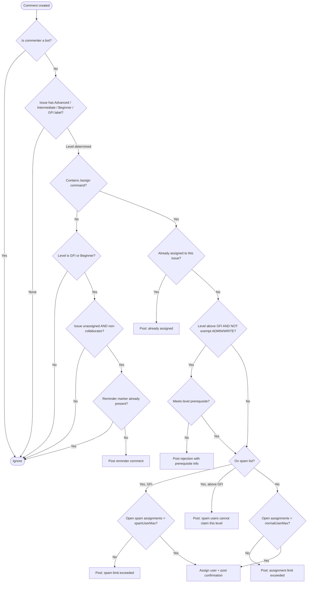

**Level prerequisites (configurable):**

| Level | Prerequisite | Default |
|---|---|---|
| GFI | none | — |
| Beginner | ≥ N closed GFI issues | 1 |
| Intermediate | ≥ N closed Beginner issues | 0 (guard inactive) |
| Advanced | ≥ N closed Intermediate issues | 1 |

**Config keys:** `assignment-limits.normal-user-max`, `assignment-limits.spam-user-max`, `guards.required-gfi-count-for-beginner`, `guards.required-beginner-count-for-intermediate`, `guards.required-intermediate-count-for-advanced`

---

### 1.2 `/unassign`

**Handler:** `UnassignCommandHandler`
**Feature flag:** `features.unassign-command`
**Trigger:** `issue_comment` created on any open issue

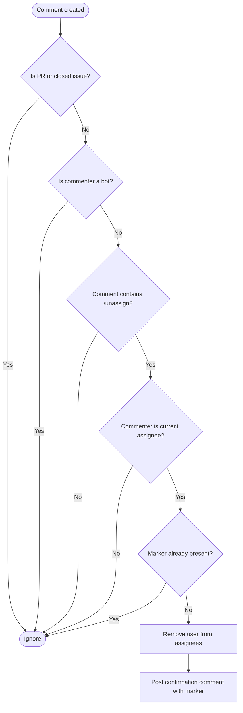

---

### 1.3 `/working`

**Handler:** `WorkingCommandHandler`
**Feature flag:** `features.working-command`
**Trigger:** `issue_comment` created on any issue or PR

The `/working` command signals active work. It also acts as an **inactivity immunity token**: posting `/working` within the inactivity window prevents unassignment by `InactivityUnassignTask`.

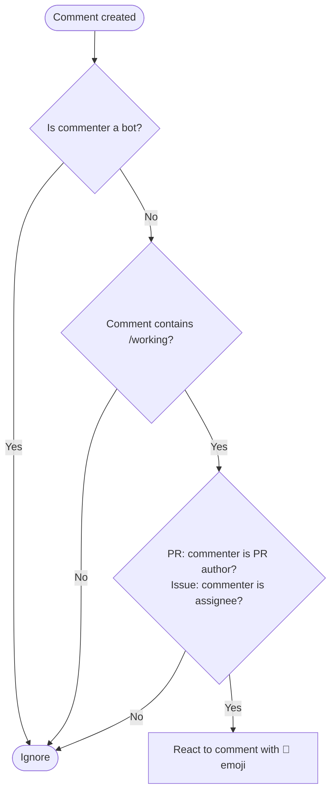

---

## 2. Issue Assignment Enforcement

### 2.1 Assignment Limit Enforcement

**Handler:** `AssignmentLimitHandler`
**Feature flag:** `features.assignment-limit`
**Trigger:** `issues` event with action `assigned`

This handler fires whenever GitHub assigns a user, regardless of how the assignment happened (API, UI, or another handler). It is the backstop that enforces per-user limits.

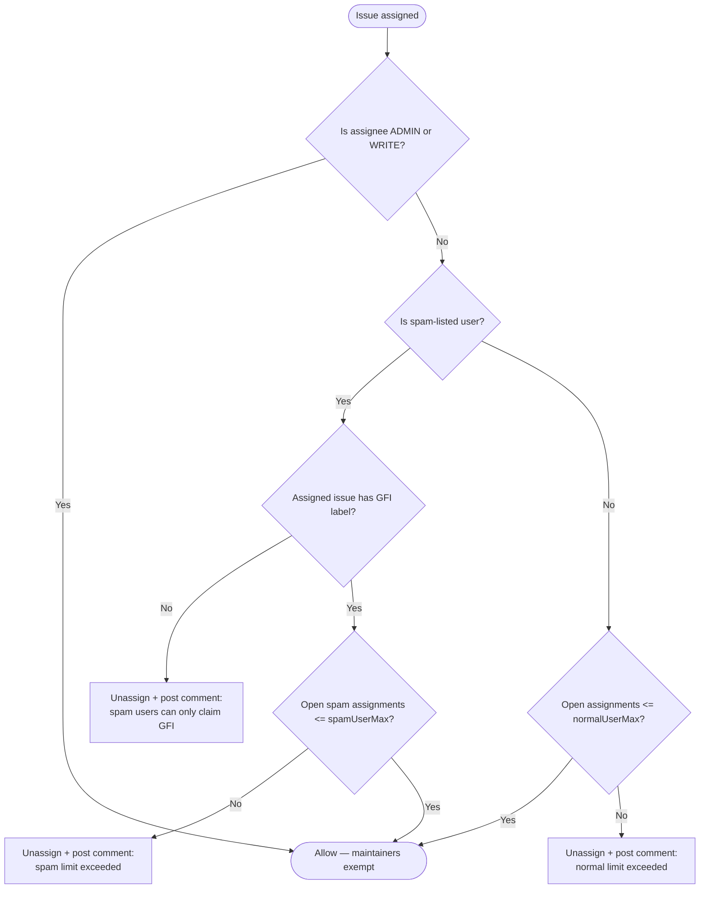

---

### 2.2 Intermediate Guard

**Handler:** `IntermediateAssignmentGuardHandler`
**Feature flag:** `features.intermediate-guard`
**Trigger:** `issues` event with action `assigned`

Guards intermediate-labeled issues. Disabled entirely when `guards.required-beginner-count-for-intermediate` is 0.

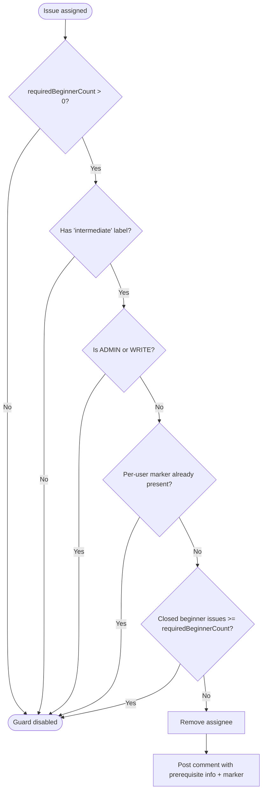

**Config key:** `guards.required-beginner-count-for-intermediate` (default: 0, i.e. disabled)

---

### 2.3 Advanced Guard

**Handler:** `AdvancedAssignmentGuardHandler`
**Feature flag:** `features.advanced-guard`
**Trigger:** `issues` event with action `assigned` OR `labeled`

The advanced guard fires on both assignment and on label addition (in case the label is added after assignment).

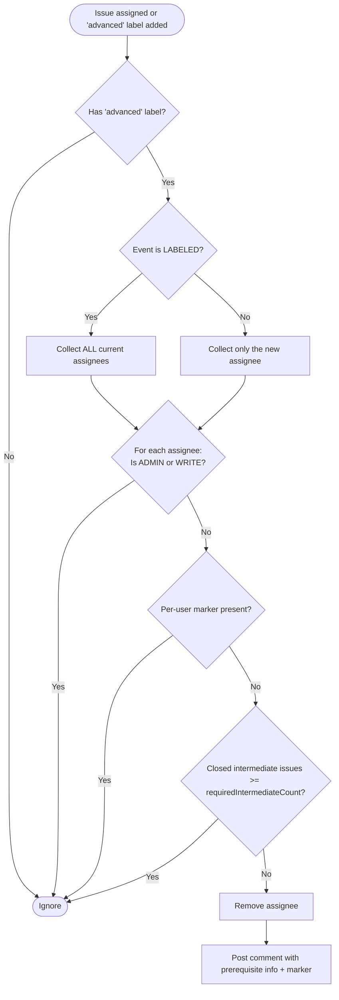

**Config key:** `guards.required-intermediate-count-for-advanced` (default: 1)

---

## 3. Contributor Onboarding

### 3.1 Mentor Assignment

**Handler:** `MentorAssignmentHandler`
**Feature flag:** `features.mentor-assignment`
**Trigger:** `issues` event with action `assigned` on Good First Issues

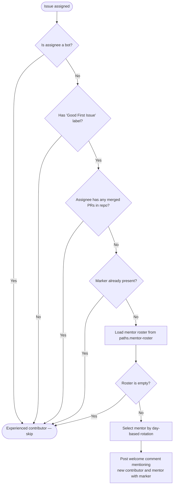

---

### 3.2 CodeRabbit Plan Trigger

**Handler:** `CodeRabbitPlanTriggerHandler`
**Feature flag:** `features.coderabbit-plan-trigger`
**Trigger:** `issues` event with action `labeled`

Posts `@coderabbitai plan` when a difficulty label is added to an issue, so CodeRabbit generates a contribution plan for the assignee.

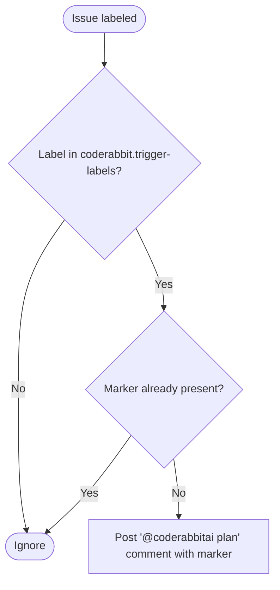

**Config key:** `coderabbit.trigger-labels` (default: `[beginner, intermediate, advanced]`)

---

## 4. Pull Request Workflows

### 4.1 Missing Linked Issue

**Handler:** `MissingLinkedIssueHandler`
**Feature flag:** `features.missing-linked-issue`
**Trigger:** `pull_request` opened, edited, or reopened

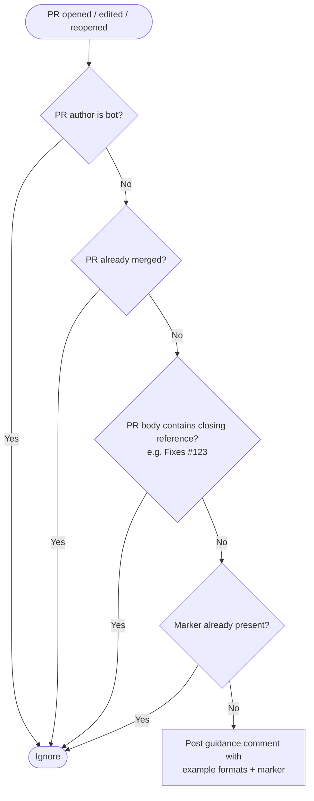

---

### 4.2 Merge Conflict Detection

**Handler:** `MergeConflictHandler`
**Feature flag:** `features.merge-conflict`
**Trigger:** `pull_request` opened, synchronized, or reopened

GitHub computes mergeability asynchronously. The handler retries up to 10 times with a 2-second delay when the state is `unknown`.

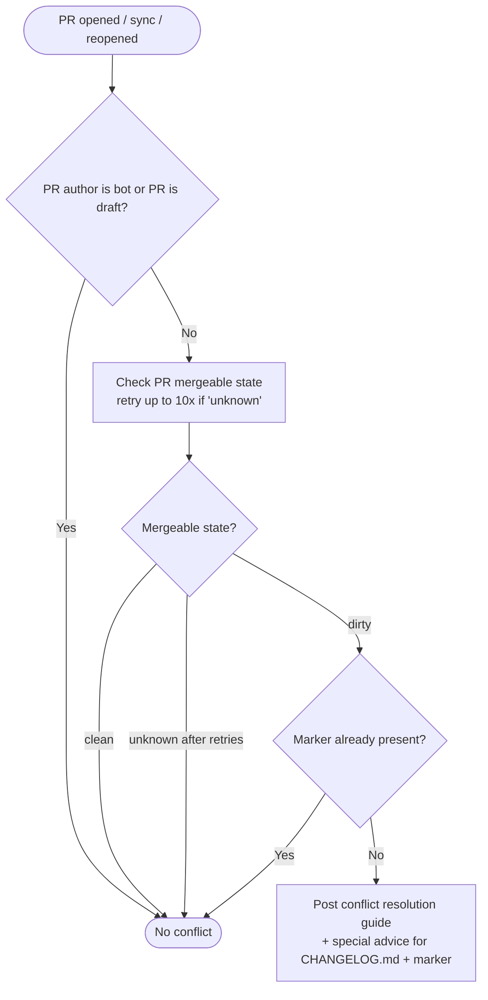

---

### 4.3 Verified Commits Check

**Handler:** `VerifiedCommitsHandler`
**Feature flag:** `features.verified-commits`
**Trigger:** `pull_request` opened or synchronized

Fails closed: if pagination is truncated and no unverified commits were found yet, one is assumed unverified.

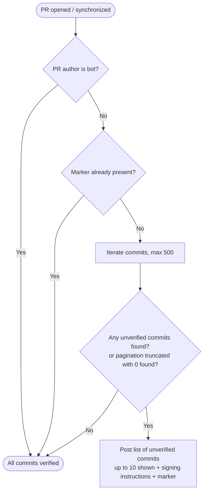

---

### 4.4 Next Issue Recommendation

**Handler:** `NextIssueRecommendationHandler`
**Feature flag:** `features.next-issue-recommendation`
**Trigger:** `pull_request` closed (merged only)

When a contributor merges their first PR on a beginner or GFI issue, the bot suggests up to 5 similar open issues to keep them engaged.

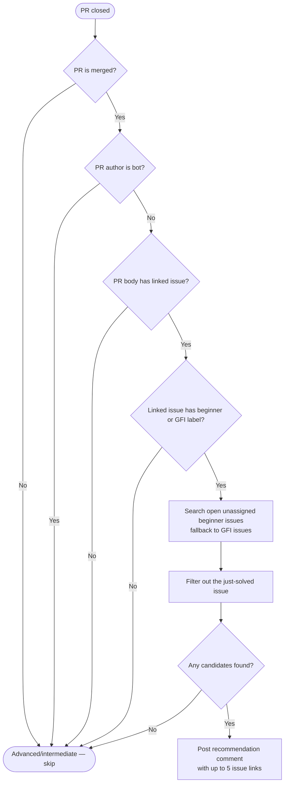

---

## 5. Notification Workflows

### 5.1 P0 Issue Alarm

**Handler:** `P0IssueAlarmHandler`
**Feature flag:** `features.p0-issue-alarm`
**Trigger:** `issues` event with action `labeled`

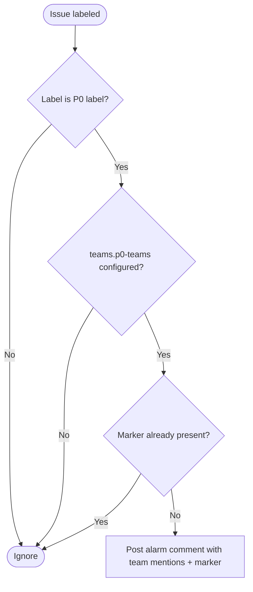

**Config key:** `teams.p0-teams` (list of `@org/team` or `@username` mentions)

---

### 5.2 GFI Candidate Notification

**Handler:** `GfiCandidateNotificationHandler`
**Feature flag:** `features.gfi-candidate-notification`
**Trigger:** `issues` event with action `labeled`

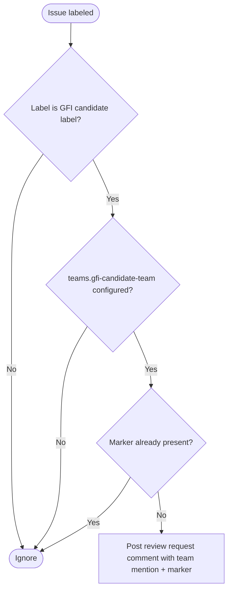

**Config key:** `teams.gfi-candidate-team` (single `@org/team` or `@username` mention)

---

### 5.3 Workflow Failure Notification

**Handler:** `WorkflowFailureNotificationHandler`
**Feature flag:** `features.workflow-failure-notification`
**Trigger:** `workflow_run` event with action `completed`

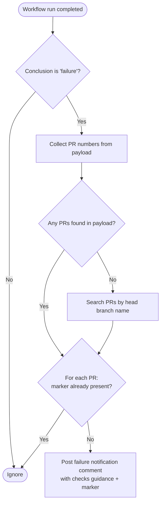

---

## 6. Scheduled Tasks

Scheduled tasks run periodically across all registered repositories. The scheduler is configured in `ScheduledTaskManager` and each task's feature flag must be enabled in the repo config.

### 6.1 Issue Reminder — No PR

**Task:** `IssueReminderNoPrTask`
**Feature flag:** `features.issue-reminder-no-pr`
**Frequency:** Daily
**Threshold:** `scheduled.issue-reminder-days` (default: 7 days)

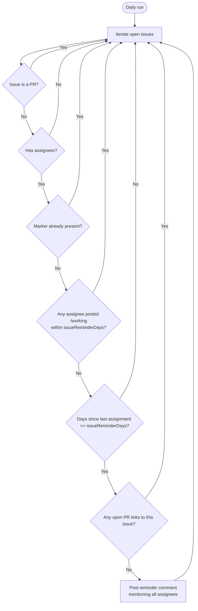

---

### 6.2 PR Inactivity Reminder

**Task:** `PrInactivityReminderTask`
**Feature flag:** `features.pr-inactivity-reminder`
**Frequency:** Daily
**Threshold:** `scheduled.pr-inactivity-days` (default: 10 days)

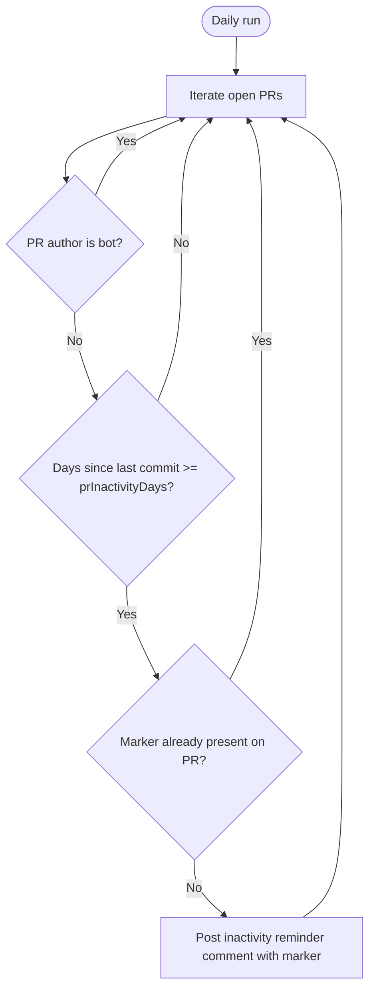

---

### 6.3 Inactivity Unassign

**Task:** `InactivityUnassignTask`
**Feature flag:** `features.inactivity-unassign`
**Frequency:** Daily
**Threshold:** `scheduled.inactivity-days` (default: 21 days)

This task has two phases. Phase A handles issues without a PR; Phase B handles issues with a stale linked PR.

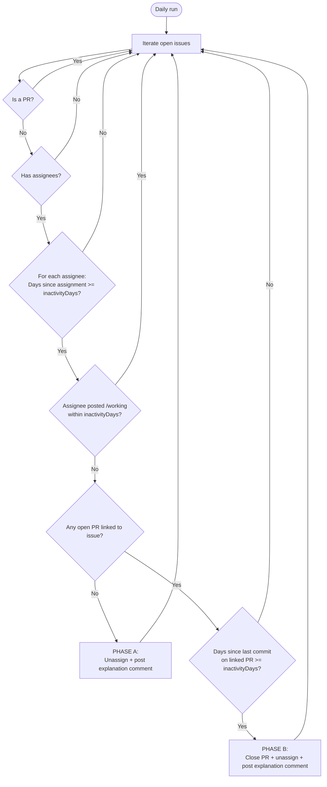

> **Note:** `/working` acts as an immunity token — posting it within the inactivity window resets the timer and prevents this task from acting.

---

### 6.4 Linked Issue Enforcer

**Task:** `LinkedIssueEnforcerTask`
**Feature flag:** `features.linked-issue-enforcer`
**Frequency:** Twice-weekly
**Grace period:** `scheduled.linked-issue-enforcer-days` (default: 3 days)

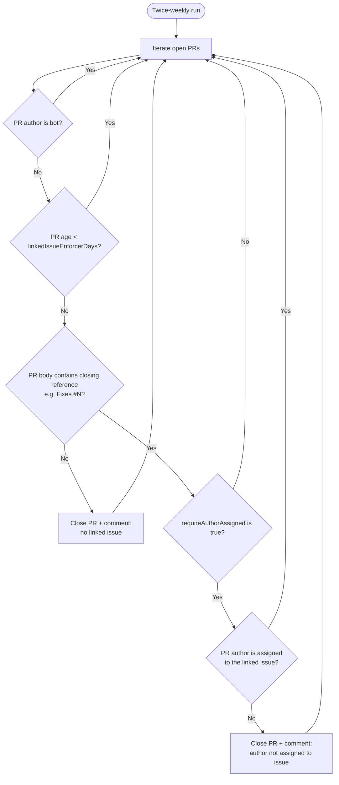

**Config key:** `scheduled.require-author-assigned` (default: true)

---

### 6.5 Community Call Reminder

**Task:** `CommunityCallReminderTask`
**Feature flag:** `features.community-call-reminder`
**Frequency:** Daily check, posts bi-weekly

The task runs every day but only posts reminders on the scheduled bi-weekly day. The schedule is derived from `scheduled.community-call.anchor-date`: reminders are sent on the same day of the week as the anchor, every 14 days from it.

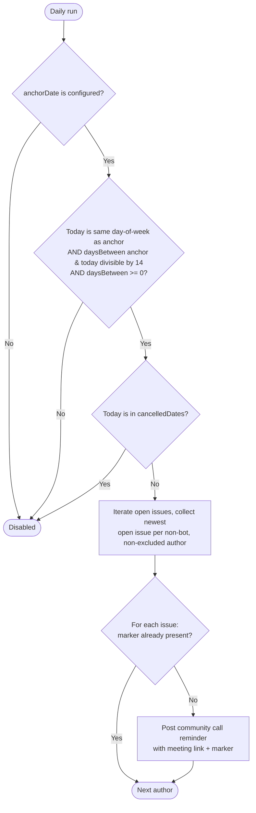

**Config keys:** `scheduled.community-call.anchor-date`, `scheduled.community-call.cancelled-dates`, `scheduled.community-call.excluded-authors`, `scheduled.community-call.meeting-link`, `scheduled.community-call.calendar-link`

---

### 6.6 Office Hours Reminder

**Task:** `OfficeHoursReminderTask`
**Feature flag:** `features.office-hours-reminder`
**Frequency:** Daily check, posts bi-weekly

Identical scheduling logic to the Community Call Reminder, but posts on open **pull requests** instead of issues.

```mermaid
flowchart TD
    A([Daily run]) --> B{anchorDate is configured?}
    B -- No --> Z([Disabled])
    B -- Yes --> C{Today matches office-hours\nbi-weekly schedule?}
    C -- No --> Z
    C -- Yes --> D{Today is in cancelledDates?}
    D -- Yes --> Z
    D -- No --> E[Iterate open PRs, collect newest\nopen PR per non-bot, non-excluded author]
    E --> F{For each PR:\nmarker already present?}
    F -- Yes --> next
    F -- No --> G[Post office hours reminder\nwith meeting link + marker]
    G --> next([Next author])
```

**Config keys:** `scheduled.office-hours.anchor-date`, `scheduled.office-hours.cancelled-dates`, `scheduled.office-hours.excluded-authors`, `scheduled.office-hours.meeting-link`, `scheduled.office-hours.calendar-link`

---

## 7. Configuration Reference

All settings are read from `.github/hiero-bot.yml` in each repository. Missing keys fall back to the documented defaults.

### Feature Flags (`features`)

| Key | Default | Controls |
|-----|---------|----------|
| `gfi-assign-command` | `true` | `/assign` on GFI issues |
| `beginner-assign-command` | `true` | `/assign` on Beginner issues |
| `unassign-command` | `true` | `/unassign` command |
| `working-command` | `true` | `/working` command |
| `assignment-limit` | `true` | Assignment limit enforcement on assign |
| `mentor-assignment` | `true` | Automatic mentor assignment for newcomers |
| `intermediate-guard` | `true` | Prerequisite guard for intermediate issues |
| `advanced-guard` | `true` | Prerequisite guard for advanced issues |
| `coderabbit-plan-trigger` | `true` | CodeRabbit plan comment on labeling |
| `missing-linked-issue` | `true` | PR linked-issue reminder |
| `merge-conflict` | `true` | Merge conflict detection on PRs |
| `verified-commits` | `true` | GPG-signed commit check on PRs |
| `next-issue-recommendation` | `true` | Suggest next issues on merged beginner PR |
| `workflow-failure-notification` | `true` | Notify on CI failure |
| `p0-issue-alarm` | `true` | Alert team on P0 label |
| `gfi-candidate-notification` | `true` | Notify GFI team on candidate label |
| `inactivity-unassign` | `true` | Daily inactivity unassignment |
| `issue-reminder-no-pr` | `true` | Daily reminder for issues without PR |
| `pr-inactivity-reminder` | `true` | Daily stale PR reminder |
| `linked-issue-enforcer` | `true` | Twice-weekly linked-issue enforcement |
| `community-call-reminder` | `true` | Bi-weekly community call reminders |
| `office-hours-reminder` | `true` | Bi-weekly office hours reminders |

### Thresholds (`scheduled`)

| Key | Default | Description |
|-----|---------|-------------|
| `inactivity-days` | `21` | Days after which inactive assignees are removed |
| `issue-reminder-days` | `7` | Days before "no PR yet" reminder fires |
| `pr-inactivity-days` | `10` | Days without commits before PR reminder fires |
| `linked-issue-enforcer-days` | `3` | Grace period before enforcing linked issue |
| `require-author-assigned` | `true` | Also enforce that PR author is assigned to linked issue |

### Guards (`guards`)

| Key | Default | Description |
|-----|---------|-------------|
| `required-gfi-count-for-beginner` | `1` | GFI issues needed before claiming beginner |
| `required-beginner-count-for-intermediate` | `0` | Beginner issues needed (0 = guard disabled) |
| `required-intermediate-count-for-advanced` | `1` | Intermediate issues needed before claiming advanced |

### Assignment Limits (`assignment-limits`)

| Key | Default | Description |
|-----|---------|-------------|
| `normal-user-max` | `2` | Max open assignments for regular users |
| `spam-user-max` | `1` | Max open assignments for spam-listed users |

### Labels (`labels`)

| Key | Default | Description |
|-----|---------|-------------|
| `good-first-issue` | `"Good First Issue"` | GFI difficulty label |
| `beginner` | `"beginner"` | Beginner difficulty label |
| `intermediate` | `"intermediate"` | Intermediate difficulty label |
| `advanced` | `"advanced"` | Advanced difficulty label |
| `p0` | `"p0"` | Critical issue label (triggers alarm) |
| `gfi-candidate` | `"good first issue candidate"` | GFI review candidate label |

### Teams (`teams`)

| Key | Default | Description |
|-----|---------|-------------|
| `p0-teams` | `[]` | List of `@org/team` mentions for P0 alarm |
| `gfi-candidate-team` | `""` | `@org/team` mention for GFI candidate review |

### Commands (`commands`)

| Key | Default regex | Description |
|-----|---------------|-------------|
| `assign-pattern` | `/assign\b` | Matches `/assign` command |
| `unassign-pattern` | `(^|\s)/unassign(\s|$)` | Matches `/unassign` command |
| `working-pattern` | `(^|\s)/working(\s|$)` | Matches `/working` command |

### Duplicate Prevention (HTML markers)

Every handler that posts a comment uses a unique HTML comment marker (e.g. `<!-- hiero-bot:inactivity-unassign -->`) embedded in the comment body. Before posting, the handler checks whether the marker is already present on the issue or PR. This prevents duplicate bot messages if the trigger fires multiple times.

The marker strings are configurable under the `markers` YAML key, but the defaults are stable and do not need to be changed in normal operation.
