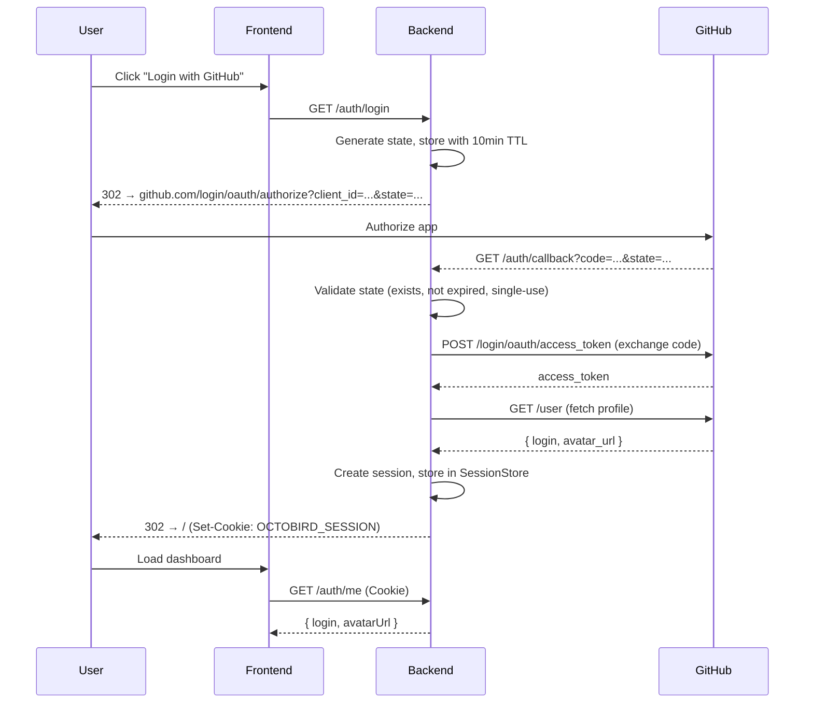

# Design: GitHub OAuth2 Login

## GitHub Issue

Part of Phase 7.1 in [ROADMAP.md](../../ROADMAP.md).

## Summary

Octobird needs authentication so that only authorized users (repo admins/maintainers) can access
the configuration dashboard. This spec covers the OAuth2 Authorization Code Flow with GitHub as
the identity provider, session management, and the frontend login experience.

## Goals

- Users can log in via "Login with GitHub" using OAuth2 Authorization Code Flow
- Server-side session management with secure cookies
- CSRF protection via cryptographically random state parameter
- Frontend login page and redirect logic for unauthenticated users
- `GET /auth/me` endpoint for the frontend to check authentication status

## Non-goals

- Persistent sessions across server restarts (in-memory is acceptable for now)
- Multi-instance / distributed session store
- Refresh token handling (GitHub OAuth tokens don't expire unless revoked)
- Registration or user management UI

## Technical approach

### Backend (Java / Helidon)

**New classes in `com.openelements.octobird.auth`:**

| Class | Responsibility |
|---|---|
| `OAuthConfig` | Record holding `clientId`, `clientSecret` from env vars |
| `SessionStore` | `ConcurrentHashMap<String, Session>` with TTL-based expiry |
| `Session` | Record: `sessionId`, `githubLogin`, `githubToken`, `avatarUrl`, `createdAt`, `expiresAt` |
| `OAuthService` | Helidon `HttpService` providing `/auth/*` routes |

**Auth endpoints (registered as Helidon `HttpService` at `/auth`):**

| Method | Path | Behavior |
|---|---|---|
| `GET` | `/auth/login` | Generate state, store with 10min TTL, redirect to GitHub authorize URL |
| `GET` | `/auth/callback` | Validate state, exchange code for token, fetch user profile, create session, set cookie, redirect to `/` |
| `GET` | `/auth/logout` | Invalidate session, clear cookie, redirect to `/login` |
| `GET` | `/auth/me` | Return `{ login, avatarUrl }` or 401 |

**Session cookie:** `OCTOBIRD_SESSION`, HttpOnly, Secure (in production), SameSite=Lax, Path=/, 8h max-age.

**State parameter:** Cryptographically random (32+ chars via `SecureRandom`), stored server-side
with 10-minute TTL, consumed after use (single-use).

**Session cleanup:** Background virtual thread runs every 30 minutes, removes expired sessions.

**Configuration:** Environment variables `GITHUB_CLIENT_ID` and `GITHUB_CLIENT_SECRET`.
If `GITHUB_CLIENT_ID` is not set, `GET /auth/login` returns 503.

### Frontend (Next.js)

- **Login page** at `app/login/page.tsx`: "Login with GitHub" button linking to `/auth/login`
- **Next.js middleware** (`middleware.ts`): For all routes except `/login`, call `/auth/me`.
  On 401, redirect to `/login`.
- **Layout**: Show logged-in user's avatar and login name in the header, with logout link.

### GitHub OAuth2 Flow

## Key design decisions

- **No external auth library.** Helidon's HTTP client is sufficient for the OAuth2 code exchange
  and GitHub API calls. This avoids adding a dependency for a straightforward flow.
- **In-memory session store.** Acceptable for a single-instance deployment. A future migration to
  database-backed sessions would only require replacing `SessionStore`.
- **OAuth scope: `read:org`.** Required to check organization membership and team permissions
  for the authorization layer (see `api-authorization` spec).

## Dependencies

- GitHub OAuth App credentials (client ID + secret) configured as env vars
- Helidon HTTP client (already available in Helidon SE)

## Security considerations

- State parameter prevents CSRF during OAuth flow
- HttpOnly + Secure cookie prevents XSS token theft
- Session TTL (8h) limits exposure window
- Single-use state prevents replay attacks

## Open questions

- Should we support a "remember me" option with longer session duration?
- Should failed login attempts be logged to the audit log?
