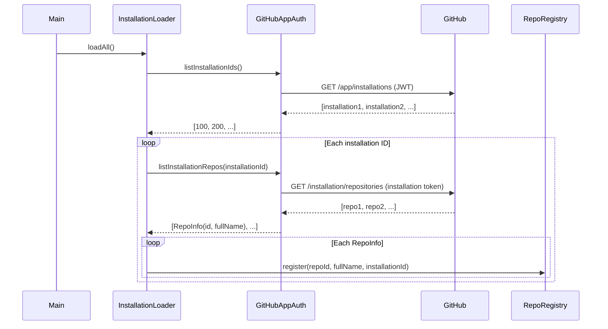

# Design: Repo Registry Startup Loading

## GitHub Issue

Standalone improvement identified during the user-repo-authorization spec work. Related to
Phase 6 (Persistence) and Phase 7 (Frontend).

## Summary

The `RepoRegistry` is an in-memory registry of repositories where Octobird is installed. It is
currently populated only by incoming webhook events (`EventRouter.route()` calls
`repoRegistry.register()` when processing a webhook). After an application restart, the registry
is empty — scheduled tasks (inactivity checks, reminders, etc.) run against zero repositories
until webhooks arrive organically.

This spec adds a startup mechanism that loads all installed repositories from the GitHub API
when the application starts, so that scheduled tasks work immediately after a restart.

## Goals

- Populate `RepoRegistry` with all installed repos on application startup
- Use the GitHub App JWT authentication (not user tokens) since there is no user context at startup
- Ensure scheduled tasks have a complete repo list from the first run
- Keep the existing webhook-based registration as a live-update mechanism

## Non-goals

- Persisting the registry in the database (in-memory is sufficient — the startup load replaces
  the need for persistence)
- Changing the `RepoRegistry` interface
- Replacing webhook-based registration (both mechanisms coexist)

## Technical approach

### Startup loading flow



### New class: `InstallationLoader`

A simple loader class with one public method:

```java
public class InstallationLoader {

    private final GitHubAppAuth auth;
    private final RepoRegistry repoRegistry;

    public void loadAll() throws IOException {
        final List<Long> installationIds = auth.listInstallationIds();
        for (final long installationId : installationIds) {
            loadInstallation(installationId);
        }
    }

    private int loadInstallation(final long installationId) {
        try {
            final List<RepoInfo> repos = auth.listInstallationRepos(installationId);
            for (final RepoInfo repo : repos) {
                repoRegistry.register(repo.id(), repo.fullName(), installationId);
            }
            return repos.size();
        } catch (final IOException e) {
            LOG.warn("Failed to load repos for installation {}, skipping", installationId);
            return 0;
        }
    }

    public record RepoInfo(long id, String fullName) {}
}
```

**Rationale: separate class over Main.java inline code.** Keeps `Main.java` focused on wiring
and startup sequencing. The loader is also testable in isolation.

### GitHub API interaction via `GitHubAppAuth`

Rather than having `InstallationLoader` work directly with kohsuke's `GHAppInstallation` and
`GHRepository` types, the GitHub API interaction is encapsulated in `GitHubAppAuth` through
two new methods:

| Method | Returns | Description |
|---|---|---|
| `listInstallationIds()` | `List<Long>` | Lists all installation IDs via app-level JWT auth |
| `listInstallationRepos(long)` | `List<RepoInfo>` | Lists repos for an installation, returning simple records |

**Rationale: decoupling from kohsuke types.** Kohsuke's `GHObject.getId()` uses an internal
bridge-method-injector (`@WithBridgeMethods`) that is incompatible with Mockito — the bridge
method intercepts even stubbing setup calls, causing `NullPointerException`. By converting
kohsuke types to simple records (`RepoInfo`) inside `GitHubAppAuth`, `InstallationLoader`
becomes fully testable with standard Mockito mocks.

### Integration in `Main.java`

The loader runs **after** persistence setup and **before** the scheduled task manager starts:

```java
// --- Persistence setup ---
final TransactionManager txManager = ...;

// --- Services ---
final RepoRegistry repoRegistry = new RepoRegistry();
final InstallationLoader installationLoader = new InstallationLoader(auth, repoRegistry);

// --- Startup loading ---
try {
    installationLoader.loadAll();
    LOG.info("Loaded {} repositories from GitHub", repoRegistry.getAll().size());
} catch (final IOException e) {
    LOG.warn("Failed to load installations on startup, registry will be populated by webhooks", e);
}

// --- Scheduled tasks (now have a populated registry) ---
final ScheduledTaskManager scheduledTaskManager = ...;
```

**Rationale: non-fatal startup failure.** If the GitHub API is unreachable at startup (network
issue, rate limit), the application still starts. The registry will be populated by incoming
webhooks as before. This matches the existing resilience model.

### GitHubAppAuth changes

Three new public methods added to `GitHubAppAuth`:

| Method | Purpose |
|---|---|
| `getAppClient()` | Returns a `GitHub` client authenticated as the app (JWT). Used internally by the other two methods. |
| `listInstallationIds()` | Calls `getAppClient().getApp().listInstallations()`, extracts IDs into `List<Long>` |
| `listInstallationRepos(long)` | Calls `getInstallationClient(id).getInstallation().listRepositories()`, maps to `List<RepoInfo>` |

The `createAppClient()` method remains `private` — `getAppClient()` delegates to it.

## Dependencies

- `GitHubAppAuth` (existing, 3 methods added)
- `RepoRegistry` (existing, unchanged)
- kohsuke github-api (used internally by `GitHubAppAuth`, not by `InstallationLoader`)

## Security considerations

- The app-level JWT is only used to list installations — no repo-level access
- Installation tokens are scoped to the specific installation and cached by `GitHubAppAuth`
- No user data is involved in the startup loading process
