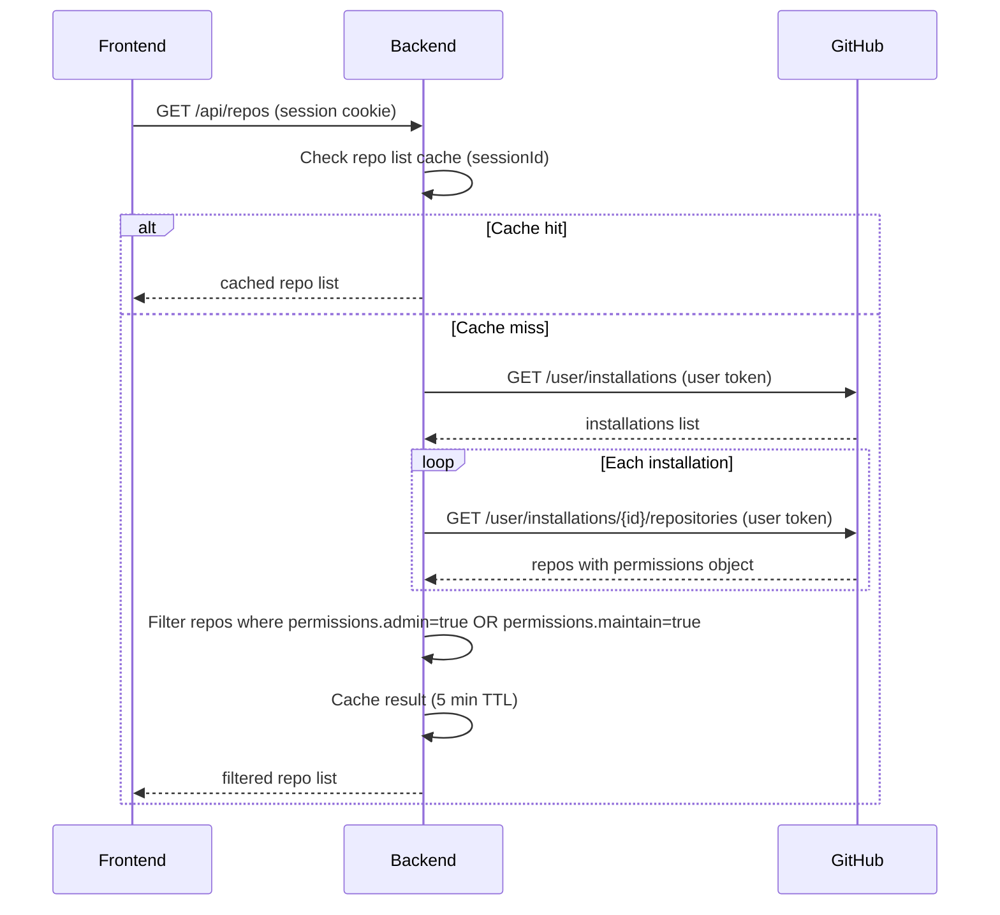

# Design: User-to-Repo Authorization via GitHub API

## GitHub Issue

Part of Phase 7 in [ROADMAP.md](../../ROADMAP.md). Enhances `api-authorization` and `oauth2-login` specs.

## Summary

The `GET /api/repos` endpoint currently returns all installed repositories from the in-memory
`RepoRegistry` without filtering by user permissions. Any authenticated user can see every repo
where Octobird is installed — a security leak. This spec replaces the RepoRegistry-based listing
with GitHub's User Access Token API, ensuring users only see repos where they have admin/maintain
permission.

## Goals

- `GET /api/repos` returns only repos the authenticated user has admin/maintain access to
- Use GitHub's `GET /user/installations` and `GET /user/installations/{id}/repositories` endpoints
  with the user's OAuth access token (intersection principle)
- Cache the repo list per session with 5-minute TTL
- Automatically invalidate cache via webhook events when repo access changes
- Invalidate session when the user's GitHub token is revoked

## Non-goals

- Custom team or role management (GitHub's org/team model handles this)
- Fine-grained permissions beyond admin/maintain
- Persistent permission storage in database (cache is in-memory, session-scoped)
- HTTP-level integration tests with WireMock (deferred to roadmap Phase 7.5)

## Technical approach

### API call chain

When `GET /api/repos` is called, the backend uses the user's GitHub access token (stored in
`Session.githubToken()`) to query GitHub:



**Rationale: GitHub API over local permission table.** GitHub's permission model accounts for
direct collaborator access, team membership, org defaults, and enterprise policies. A local
table would require constant synchronization and risk drifting out of sync.

### Permission filtering

The `GET /user/installations/{id}/repositories` response includes a `permissions` object per
repository:

```json
{
  "id": 123,
  "full_name": "owner/repo",
  "permissions": {
    "admin": true,
    "maintain": false,
    "push": true,
    "triage": true,
    "pull": true
  }
}
```

The backend filters to repos where `permissions.admin == true || permissions.maintain == true`.
No separate permission-check call per repo is needed.

### Changes to `ReposApiService`

Replace the current implementation that reads from `RepoRegistry` with a new service that:

1. Extracts the `Session` from the request context (set by `AuthorizationFilter`)
2. Calls a new `UserRepoService.getAccessibleRepos(session)` method
3. Returns the filtered list as JSON

`RepoRegistry` continues to exist for `ScheduledTaskRunner` and `EventRouter` (internal use),
but is no longer injected into `ReposApiService`.

### New class: `UserRepoService`

| Method | Responsibility |
|---|---|
| `getAccessibleRepos(Session)` | Returns filtered repo list (cached or fetched from GitHub) |
| `invalidateCache(String sessionId)` | Clears cached repo list for a session |
| `invalidateAllCaches()` | Clears all cached repo lists (used on webhook events) |

The service uses `HttpClient` to call GitHub's API with the user's token. It delegates caching
to `PermissionCache`.

### Cache changes in `PermissionCache`

Add repo-list-specific methods alongside the existing per-repo permission methods:

```java
// Existing (unchanged)
String get(String sessionId, String repoFullName);
void put(String sessionId, String repoFullName, String permission);

// New — repo list cache
List<String> getRepoList(String sessionId);
void putRepoList(String sessionId, List<String> repos);
```

Both caches share the same 5-minute TTL and are cleared together when a session is invalidated
via `removeAllForSession(sessionId)`.

**Rationale: specific methods over generic cache.** Type-safe methods prevent misuse and make
the cache's responsibilities explicit. A generic `get(key, type)` would obscure what is cached.

### Cache invalidation via webhooks

The `EventRouter` already processes all incoming webhooks. Add cache invalidation for these events:

| Webhook Event | Action | Cache Effect |
|---|---|---|
| `installation.repositories_added` | Repos added to installation | `invalidateAllCaches()` |
| `installation.repositories_removed` | Repos removed from installation | `invalidateAllCaches()` |
| `member` | Collaborator permissions changed | `invalidateAllCaches()` |

`invalidateAllCaches()` is a blunt approach but correct — permission changes are infrequent,
and a 5-minute TTL limits staleness even without webhooks.

### Token revocation handling

When the user's GitHub token is revoked (user removes OAuth authorization in GitHub settings),
GitHub API calls return 401. The `UserRepoService` catches this and:

1. Invalidates the session via `SessionStore.remove(sessionId)`
2. Clears the permission cache via `PermissionCache.removeAllForSession(sessionId)`
3. Returns an empty result — the `AuthorizationFilter` will return 401 on the next request,
   and the frontend redirects to `/login`

### AuthorizationFilter changes

The `AuthorizationFilter` already checks per-repo permissions for repo-scoped endpoints. The
existing approach (calling GitHub's collaborator permission endpoint) remains unchanged. However,
since `GET /api/repos` now returns only permitted repos, the user will never navigate to a repo
they can't access — the per-repo check serves as a defense-in-depth safety net.

The filter already stores the `Session` in the request context, so `ReposApiService` can access
it without changes to the filter.

## Dependencies

- `oauth2-login` spec (provides Session with githubToken)
- `api-authorization` spec (provides AuthorizationFilter, PermissionCache)
- GitHub REST API v3: `/user/installations`, `/user/installations/{id}/repositories`

## Security considerations

- User access tokens are stored in memory only (SessionStore), never persisted
- GitHub's intersection principle ensures the token can only access repos the user AND the app
  both have access to
- The 5-minute cache TTL limits the window of stale permissions
- Webhook-based cache invalidation reduces staleness further for common changes
- Token revocation is handled gracefully (session invalidation + login redirect)
- `RepoRegistry` is no longer exposed via REST — only used internally for scheduled tasks
